# Table of Contents

- [Executive Summary](#executive-summary)
- [Equipment and Tools](#equipment-and-tools)
- [Details of Tracy’s iPhone](#details-of-tracys-iphone)
- [Evidence to Establish Personas](#evidence-to-establish-personas)
- [Evidence relating to theft of valuable stamps](#evidence-relating-to-theft-of-valuable-stamps)
- [Evidence relating to defacement of museum art](#evidence-relating-to-defacement-of-museum-art)
- [Plot Timeline](#plot-timeline)
- [Conclusion](#conclusion)
- [Appendix A: Correspondence Evidence](#appendix-a-correspondence-evidence)
- [Appendix B: WiFi and GPS Location Information](#appendix-b-wifi-and-gps-location-information)

# Executive Summary

On January 21, 2016, Digitech Inc. was called in to assist the National Gallery, Washington D.C. (NGDC) case involving the conspiracy associated with the theft of valuable stamps and defacing of museums are at the NGDC.

-   Tracy is a suspect in the aforementioned conspiracy.
-   As part of the investigation, Tracy’s iPhone was taken into custody.
-   Digitech, Inc. was tasked with investigating evidence relevant to the aforementioned conspiracy.

As described fully in the report, Digitech, Inc. made the following findings.

Tracy was an accomplice of the conspiracies associated with the theft of stamps and defacement of the museum based off of her communication logs found about Pat, Carry, and an unknown person.

## Equipment and Tools

Digitech used Autopsy, an open-source forensics platform, on a virtual Kali Linux machine to analyze a bit stream image of Tracy’s iphone data. Google Maps was used to discover the locations. Nano and notepad was used as a text editor and analysis on the Kali Linux terminal. A Coco converter was used to specify the times for each piece of evidence related to communciation.

# Details of Tracy’s iPhone

# Evidence to Establish Personas

This section establishes aliases, phone numbers, email addresses associated with each person, and relationships between each individual.

$~$

Tracy:

Phone Number: (703) 340-9961

Personal Email: [tracysumtwelve@gmail.com](mailto:tracysumtwelve@gmail.com), coralbluetwo@hotmail.com

Work Email: tracy.sumtwelve@nationalgallerydc.org

Relationship: Accused

$~$

Pat:

Phone Number: 571-308-3236

Email: [patsumtwelve@gmail.com](mailto:patsumtwelve@gmail.com), perrypatsum@yahoo.com

Relationship: Tracy’s Brother

$~$

Terry:

Phone Number: 703-829-6701

Email: unknown

Relationship: Daughter of Tracy and Joe

$~$

Joe:

Phone Number: unknown

Email: [joe.sum.twelve@gmail.com](mailto:joe.sum.twelve@gmail.com)

Relationship: Tracy’s ex-husband

$~$

Carry:

Phone Number: 202-725-2124

Email: [carrysum2012@yahoo.com](mailto:carrysum2012@yahoo.com)

Relationship: Tracy’s acquaintance and accomplice

$~$

Tracy was in contact with Terry, Carry, and Pat very often. Tracy exchanged several suspicious emails and messages with Carry and Pat. Tracy and her brother have been in contact with another conspirator named “King kthings” with an email “[throne1966@hotmail.com](mailto:throne1966@hotmail.com)”. Joe’s information is mostly unavailable from the data collected.

# Evidence relating to theft of valuable stamps

This sub-section provides details regarding the evidence found as it relates to the theft of valuable stamps.

Regarding the theft of valuable stamps, Tracy and Pat had communicated with each other through SMS and email. Pat sent a message about needing PDF’s for certain documents and Tracy had sent another zip file that was not password-protected like the original. In the zip file contained three PDF files of stamp insurances.

The following figures are images of stamps that were found in Tracy’s phone gallery that coincide with the stamps mentioned in the insurance documents.

Figure 1. Email attachment of “Stamp insurance 1.pdf”

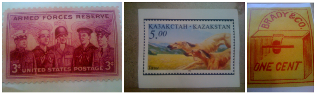

Location of stamps are in consecutive order of the three photos presented:

-   /vol_vol5/mobile/Media/DCIM/100APPLE/IMG_0056.JPG
-   /vol_vol5/mobile/Media/DCIM/100APPLE/IMG_0051.JPG
-   /vol_vol5/mobile/Media/DCIM/100APPLE/IMG_0057.JPG

Figure 2. Email attachment of “Stamp Insurance 2.pdf”

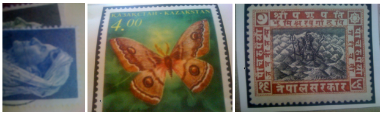

Location of stamps are in consecutive order of the three photos presented:

-   /vol_vol5/mobile/Media/DCIM/100APPLE/IMG_0067.JPG
-   /vol_vol5/mobile/Media/DCIM/100APPLE/IMG_0055.JPG
-   /vol_vol5/mobile/Media/DCIM/100APPLE/IMG_0050.JPG

Figure 3. Email attachment of “Stamp insurance 3.pdf”

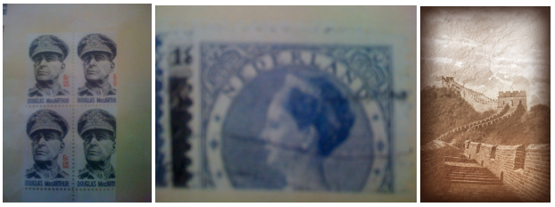

Location of stamps are in consecutive order of the three photos presented:

-   /vol_vol5/mobile/Media/DCIM/100APPLE/IMG_0054.JPG
-   /vol_vol5/mobile/Media/DCIM/100APPLE/IMG_0065.JPG
-   /vol_vol5/mobile/Media/DCIM/100APPLE/IMG_0071.JPG

Hence, from the evidence that we have collected, we can assume that Tracy was an accomplice in Pat’s plan to steal the stamps that were documented for insurance assurance by the National Gallery.

# Evidence relating to defacement of museum art

This sub-section provides details regarding the evidence found as it relates to the defacement of museum art.

Pat and Tracy had exchanged emails with a co-conspirator who went by the name of King Kthings. Pat had sent an email that threatened King to co-operate with his planned heist at the National Gallery. King had sent an email about certain tool that they would need to get the job done.

Figure 4. Email attachment from co-conspirator

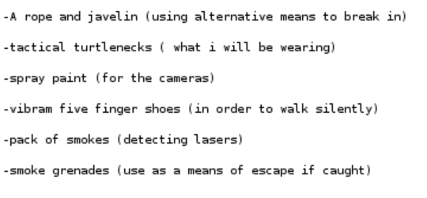

Tracy communicated with Carry as well about holding a flash mob event. Based on the given information about the case, this flashmob was used as a distraction for King Kthings for the heist to be successful. Carry requested for her tablet to bypass security through email which Tracy agreed to.

From this evidence, we can assume that Tracy acted as an accomplice for Pat’s and Carry’s plans that involved the defacement of art.

# Plot Timeline

-   On June 19th, 2012 at 1:26 PM, Tracy accepts a proposition that her brother, Pat, had sent her an email written in French. Pat onboards her on the same day by making Tracy create an alias to use and sent an audio recording labeled Crazydave1.mp3 about setting up a VirtualMachine box for later use.
-   June 28th, 2012, Coral (Tracy) emailed Perry (Pat) about a foreign exhibit that they might be interested in for a future job. Pat replied with enthusiasm of a possible “lucky break”. Tracy and Pat continued to communicate until July 3rd, 2012.
-   July 5th, 2012, Carry reached out to Tracy about meeting up with each other on July 6th, 2012.
-   on July 6th, 2012, Pat sent an email to King kthings and a carbon copy to Tracy regarding plans of their heist at the national gallery. On the same day, Tracy and Carry met up at Bubba’s Grill. Pat sent a message later in the evening.
-   On July 9th, 2012, Tracy sent Coral a zip file of documents of stamp insurances. Carry sent an email to Tracy at 2:18 PM about a request for her tablet to pass through security. Carry revealed her planned flash mob event.
-   July 10th, 2012, Tracy and Carry confirm to meet the next day at 9 am to fulfill Carry’s request. King kthings sent an email to Pat regarding tools they need. Pat passed the email to Tracy.
-   July 11th, 2012, Carry added Tracy to her Google+ circle and shared an album. Tracy and Carry exchanged text messages for their meet up in front of the National Gallery to bypass Carry’s tablet. Tracy sent an email to Carry after that emphasized confidentiality and the financial strain that Tracy is in. The flashmob and defacement of art ensued.

# Conclusion

Evidence found on Tracy’s iPhone indicated the following:

-   Pat reached out to Tracy for a certain “job”. They used aliases for email accounts and a virtual machine to communciate to each other. Tracy used [coralbluetwo@hotmail.com](mailto:coralbluetwo@hotmail.com) and went by another name called Coral. Pat used [perrypatsum@yahoo.com](mailto:perrypatsum@yahoo.com) and went by Perry.
-   Carry reached out to Tracy through email to plan a flash mob event. Closer to the date, Carry specifically asked Tracy to allow a tablet through security to get it set up which Tracy agreed to.
-   Pat and Tracy had an individual plan to steal stamps from the National Gallery. They stole a total of nine stamps based on the provided evidence.
-   Pat blackmailed “King”, the co-conspirator, to participate in the defacement of art by explicitly stating information that is reportable to his parole officer. King agreed to join and emailed back a list of items that he would need.
-   Tracy was an accomplice to the defacement of art and stolen stamps of the National Gallery for financial reasons.

# 

# Appendix A: Correspondence Evidence

This subsection will provide an amalgamation of the email and SMS correspondence evidence.

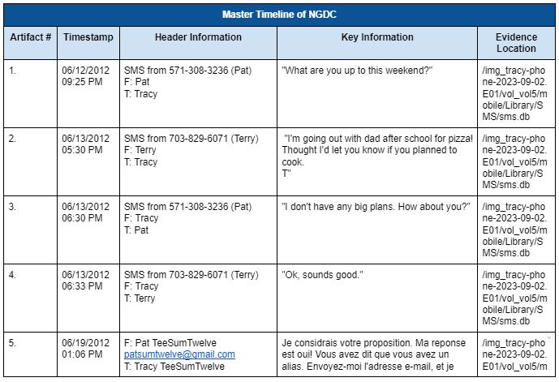
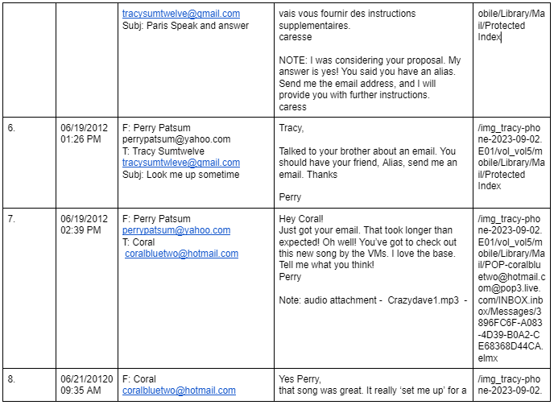
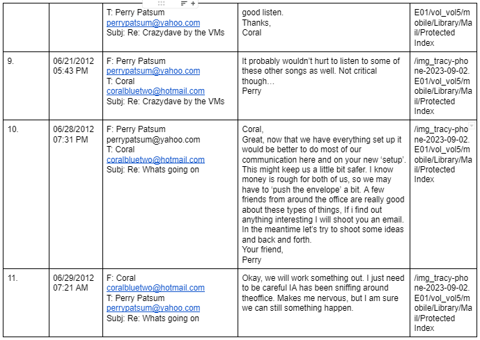
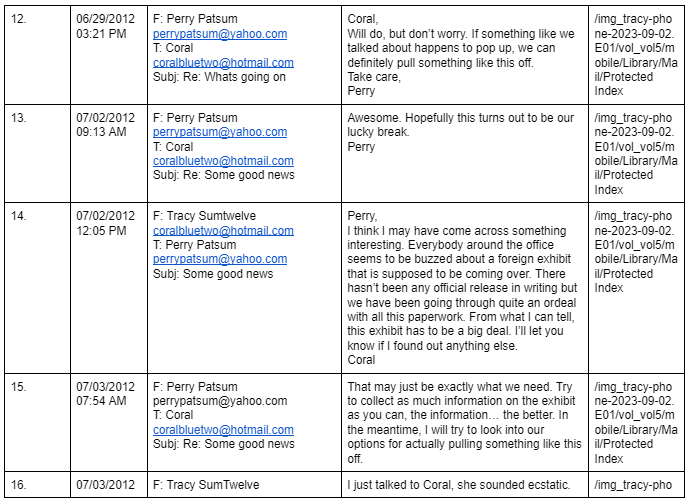
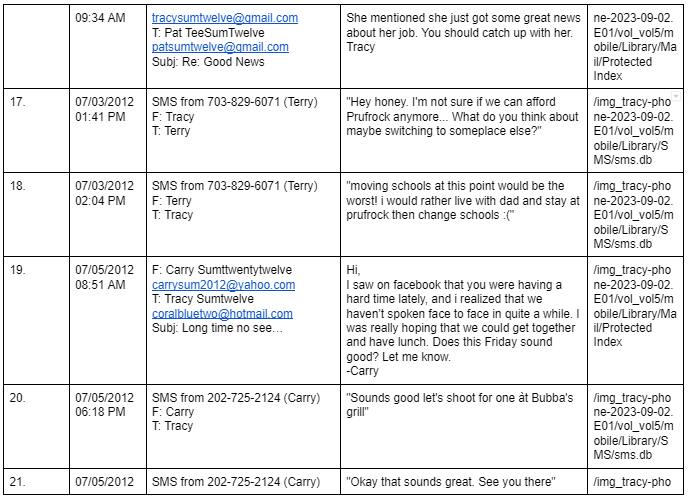
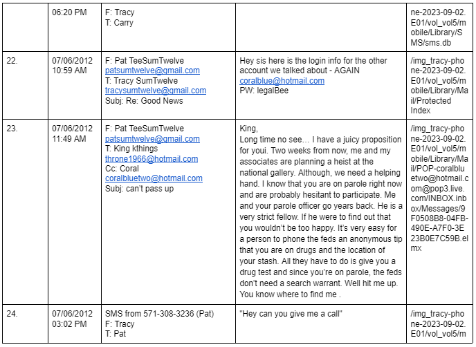
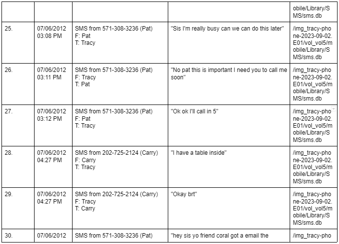
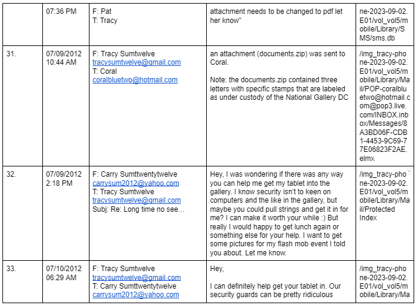
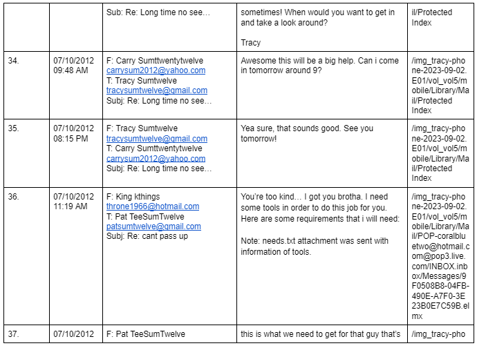

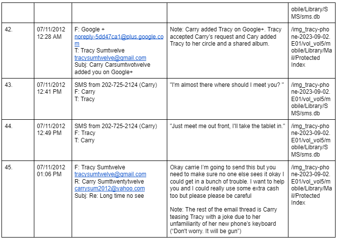
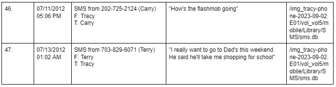

# Appendix B: WiFi and GPS Location Information

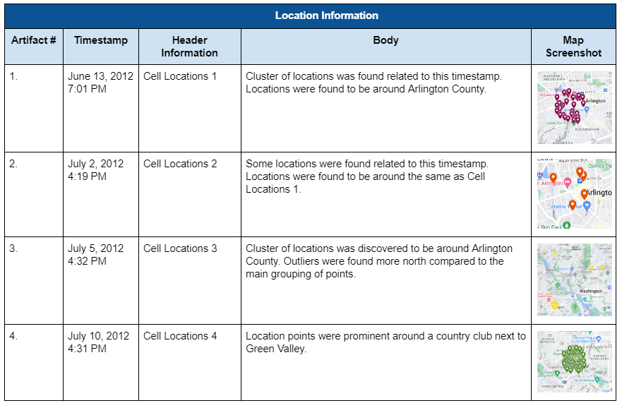
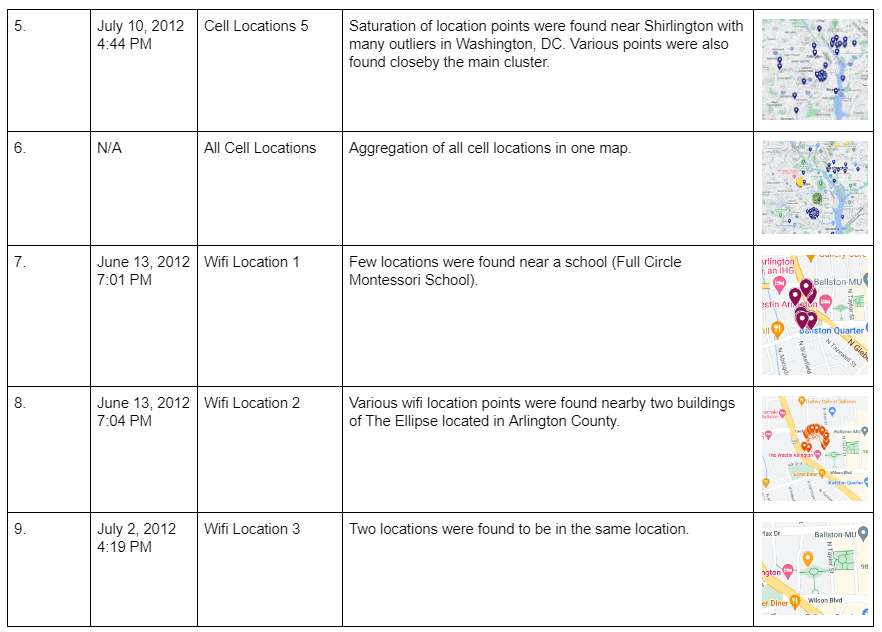
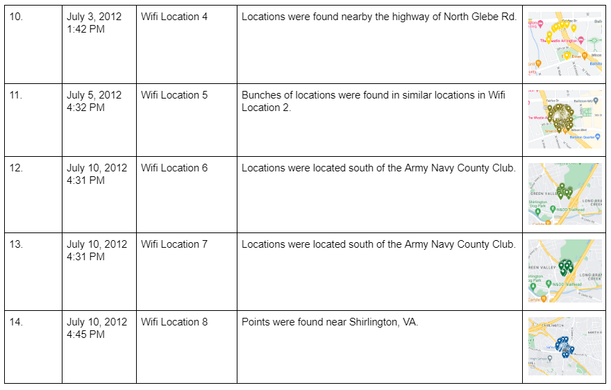
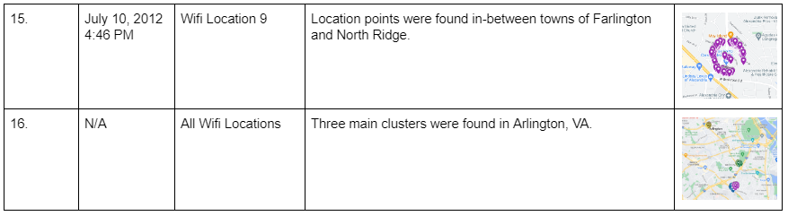

